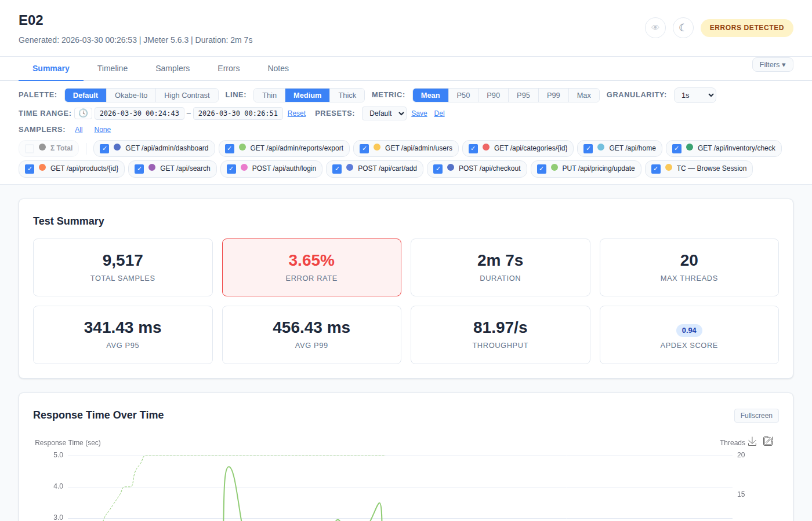
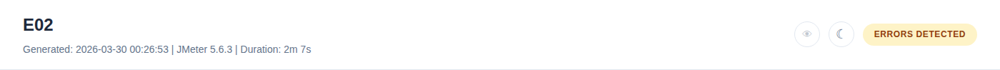
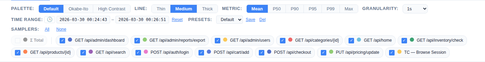

# Getting Started

## What Is Web Insight Report?

Web Insight Report is an **Apache JMeter plugin** that generates modern, interactive web reports from your load test results — a powerful alternative to JMeter's built-in HTML dashboard.

**Why use it instead of the native report?**

| | Native JMeter Report | Web Insight Report |
|---|---|---|
| Interactivity | Static charts, no filtering | Zoom, pan, filter, sort, fullscreen, drag-reorder |
| Sampler filtering | None | Per-sampler toggle, color picker, presets |
| Error analysis | Basic table | Charts (pie, bar, timeline), expandable error rows with response bodies |
| SLA / Pass-Fail | Not supported | Configurable thresholds, PASS/WARN/FAIL badges, Apdex score |
| Baseline comparison | Not supported | Side-by-side comparison with regression detection |
| Dark mode | No | Full dark theme + colorblind mode |
| Annotations | No | Markdown notes, timeline markers, verdict, sampler notes |
| CI/CD integration | No | JSON summary + JUnit XML output |
| Chart export | No | PNG, SVG, CSV per chart/table |
| Customization | Limited | Palette, line thickness, metric toggle, granularity, presets |

The report is a **single self-contained HTML file** — no server, no CDN, no internet required. Just open it in any browser.

## Requirements

- Apache JMeter **5.6.3+**
- Java **11+**

## Installation

### Option 1: Download (recommended)

Download the latest JAR from the [Releases page](https://github.com/aharon890/JmeterWebInsightReport/releases) and copy it to `$JMETER_HOME/lib/ext/`.

### Option 2: Build from source

```bash
mvn clean package -DskipTests
cp jmeter-web-insight-report/target/jmeter-web-insight-report-1.0.0.jar $JMETER_HOME/lib/ext/
```

### Use in JMeter

**GUI mode:** Add the **Web Insight Report** listener to your test plan (Add → Listener → Web Insight Report).

**CLI mode (non-GUI):** The listener works with `-n` flag — the report generates automatically when the test ends.

```bash
jmeter -n -t test.jmx \
  -Jwebinsight.report.output=/results \
  -Jwebinsight.report.filename=report_${timestamp}.html \
  -Jwebinsight.report.title="My Load Test"
```

**From existing JTL (no test plan change):**

```bash
jmeter -g results.jtl -o report-dir/
```

See [Export & CI/CD](11-Export-Integration.md) for setup details on the `-g -o` path.

## Quick Configuration

| Property | Default |
|----------|---------|
| `webinsight.report.title` | `JMeter Web Insight Report` |
| `webinsight.report.output` | Working directory |
| `webinsight.report.filename` | `web-insight-report.html` |
| `webinsight.apdex.threshold` | `500` (ms) |
| `webinsight.report.junit` | `false` |

Place `report-annotations.json` in the output directory for SLA thresholds, notes, and timeline markers. Place `baseline.jtl` for run comparison.

---



## Report Layout

The report has 3 main areas:

### Header


- **Report title** — configurable via GUI or `-Jwebinsight.report.title`
- **Subtitle** — shows "Generated: YYYY-MM-DD HH:mm:ss", JMeter version, and test duration
- **Colorblind toggle** (eye icon) — swaps green/red to blue/orange
- **Dark mode toggle** (moon/sun icon) — full dark theme
- **Status badge** — shows overall test status:
  - `SLA PASS` / `SLA WARNING` / `SLA FAIL` (when SLA thresholds configured)
  - `ALL PASSED` / `ERRORS DETECTED` (when no SLA)

### Tab Navigation

Six tabs organize the report:

| Tab | Purpose |
|-----|---------|
| **Summary** | At-a-glance metrics, response time chart, top 5 slowest, notes preview |
| **Timeline** | Full time-series charts (9 chart types) |
| **Samplers** | Statistics table with sorting, filtering, inline detail charts |
| **Errors** | Error breakdown charts and detail tables |
| **Compare** | Baseline vs current comparison (only visible when `baseline.jtl` exists) |
| **Notes** | Test notes (Markdown), timeline markers, verdict |

A **"Filters ▾"** dropdown next to the tabs controls which filter bar rows are visible.

### Filter Bar



A persistent bar below the tabs with 3 collapsible rows:

- **Row 1:** Palette (Default/Okabe-Ito/High Contrast), Line thickness (Thin/Medium/Thick), Metric (Mean/P50/P90/P95/P99/Max), Granularity (1s to 10min)
- **Row 2:** Time range display (wall-clock/elapsed toggle), Presets (save/load/delete)
- **Row 3:** Sampler checkboxes (select/deselect individual samplers, All/None buttons, color dots)

All filter settings affect all tabs globally. Settings persist in browser localStorage.

## Output Files

Each report generation produces:

| File | Description |
|------|-------------|
| `web-insight-report.html` | Self-contained interactive report |
| `web-insight-report.json` | Machine-readable CI/CD summary |
| `web-insight-report.xml` | JUnit XML (when enabled) |
| `web-insight-data.json` | External chart data (large tests only) |
