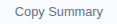

# Summary Tab

The default view when opening the report. Provides at-a-glance test metrics.

## Metric Cards

### Row 1 — Primary Metrics (always visible)

| Card | Value | Behavior |
|------|-------|----------|
| **Total Samples** | Integer count of all requests | Formatted with comma separators (e.g., 6,654) |
| **Error Rate** | Percentage of failed requests | Card background turns red (`card-error` class) when errors > 0 |
| **Duration** | Test execution time | Human-readable: "2m 11s", "1h 5m 30s" |
| **Max Threads** | Peak concurrent threads | Maximum active thread count during test |

### Row 2 — Statistical Metrics (visible when data available)

| Card | Value | Behavior |
|------|-------|----------|
| **Avg P95** | Weighted average P95 across all samplers | Shows SLA mini-badge (PASS/WARN/FAIL) when SLA configured |
| **Avg P99** | Weighted average P99 | Shows SLA mini-badge |
| **Throughput** | Overall requests per second | Format: "49.80/s" |
| **Total Errors** | Absolute error count | Integer |

### Apdex Card

Displays the overall Apdex (Application Performance Index) score:

- **Score range:** 0.00 to 1.00
- **Color coding:**
  - Excellent (> 0.94) — green
  - Good (0.85–0.94) — blue
  - Fair (0.70–0.85) — amber
  - Poor (0.50–0.70) — orange
  - Unacceptable (≤ 0.50) — red
- **Label:** Shows the satisfaction threshold T (e.g., "T=500ms")
- **Calculation:** `Apdex = (Satisfied + Tolerating/2) / Total` where Satisfied = response < T, Tolerating = response < 4T

## Response Time Over Time Chart

A line chart showing response time trends per sampler during the test.

**Default metric:** Mean response time (configurable via the Metric toggle in the filter bar).

**Controls:**
- **Fullscreen** — button expands chart to full viewport; click again or press Escape to exit
- **Chart legend** — click a sampler name to hide/show its line
- **Zoom** — click-drag on chart to zoom into a time range
- **Pan** — shift+drag to scroll while zoomed
- **Time range slider** — draggable slider at bottom of chart
- **PNG/SVG export** — camera and image icons in the chart toolbox (top-right)

**Active threads overlay:** A dashed line showing thread count over time (right Y-axis).

## Top 5 Slowest Samplers (by P95)

A ranked list of the 5 samplers with the highest P95 response times.

Each row shows:
- **Rank** — number 1-5
- **Sampler name** — the request label
- **P95 value** — "p95: 1,234 ms"
- **Mean value** — "mean: 567 ms"
- **Error rate** — shown only when errors > 0 (e.g., "4.05% errors")

**CSV download:** Click the ↓ icon to download as `top5-slowest-samplers.csv`.

## Copy Summary

The **"Copy Summary"** button copies a formatted HTML table of all metrics to the clipboard, suitable for pasting into:
- Confluence pages
- SharePoint documents
- Email reports

## Engineer Notes Preview

When annotations are loaded (`report-annotations.json`), a compact preview of the test notes appears on the Summary tab. Click the "Notes" tab for the full view.
