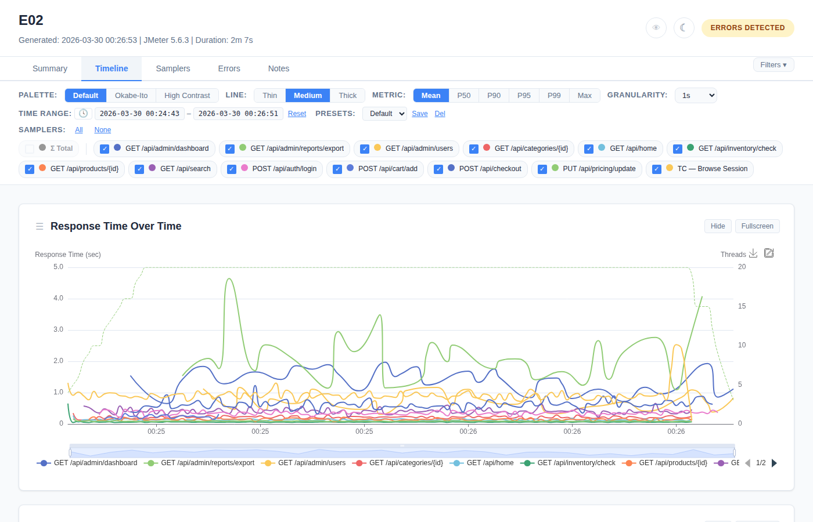
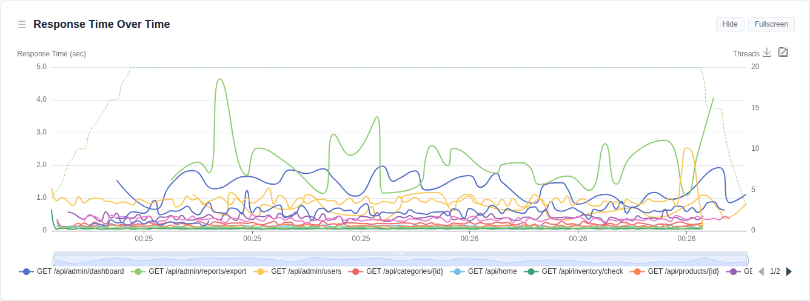
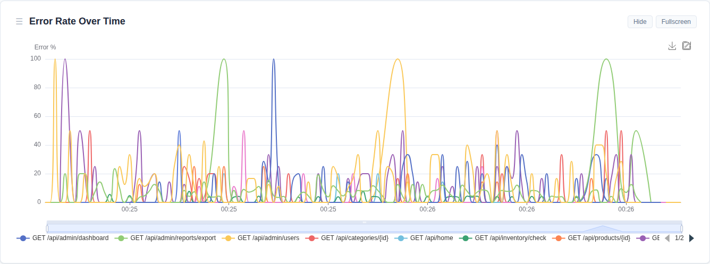
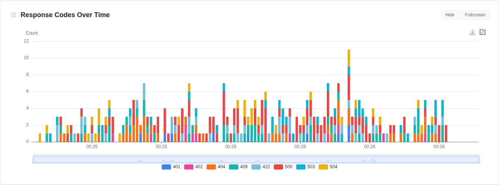
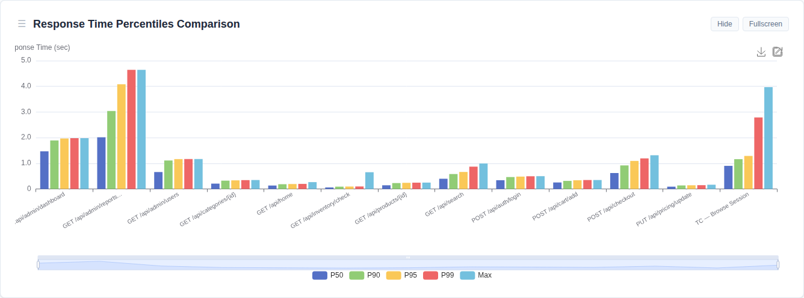
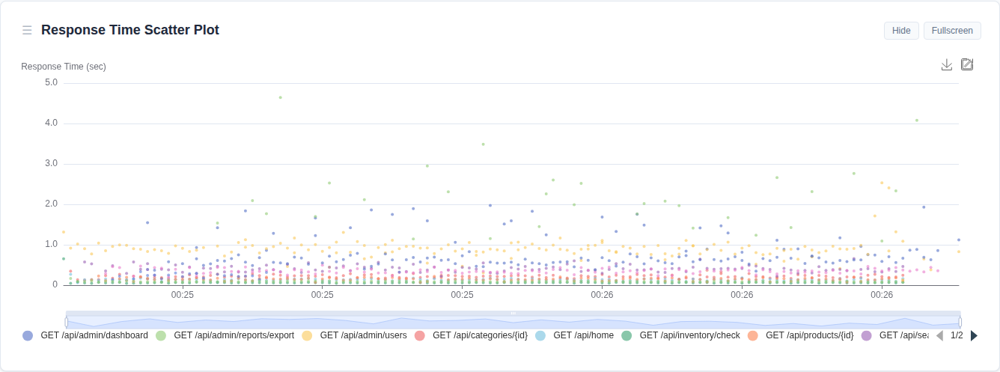
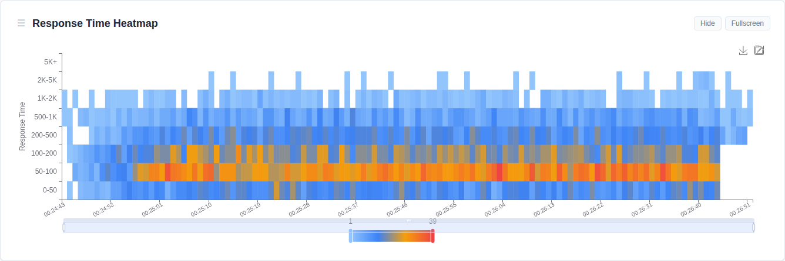
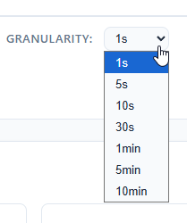

# Timeline Tab

Full time-series visualization of test metrics over the test duration.



## Charts

9 charts are displayed in this default order:

1. **Response Time Over Time** — per sampler + active threads overlay
2. **Throughput Over Time** — requests/sec per sampler
3. **Error Rate Over Time** — error % per sampler
4. **Bytes Throughput** — received/sent KB/s per sampler
5. **Connect Time vs Latency** — stacked area breakdown
6. **Response Codes Over Time** — stacked bars by HTTP status code
7. **Percentiles Comparison** — grouped bars (P50/P90/P95/P99/Max)
8. **Scatter Plot** — individual data points for outlier detection
9. **Heatmap** — response time distribution over time

### Chart Examples

**Response Time Over Time:**



**Error Rate Over Time:**



**Response Codes Over Time:**



**Response Time Percentiles Comparison:**



**Scatter Plot:**



**Response Time Heatmap:**



## Chart Controls

Every chart has these controls in its header:

| Control | Location | Behavior |
|---------|----------|----------|
| **Drag handle** (☰) | Left of title | Drag to reorder charts; order saved to localStorage |
| **Hide** | Right of title | Hides the chart section; text changes to "Show" |
| **Fullscreen** | Right of title | Expands chart to full viewport; click again to exit |
| **PNG export** | Chart toolbox (top-right) | Downloads chart as PNG image |
| **SVG export** | Chart toolbox | Downloads chart as SVG vector |


### Hide / Show Behavior

1. Click **Hide** on any chart → chart section collapses, button text changes to "Show"
2. A **"Show N Hidden Charts"** link appears in the toolbar above the charts
3. Click **"Show Hidden Charts"** → all hidden charts restore, all buttons revert to "Hide"
4. Hidden chart state is saved to localStorage

## Chart Interactions (ECharts)

All charts support these interactions:

| Interaction | How | Effect |
|-------------|-----|--------|
| **Hover tooltip** | Mouse over data point | Shows exact values at that time |
| **Zoom** | Click-drag on chart | Zooms into selected time range |
| **Pan** | Shift + drag | Scrolls the zoomed view |
| **Time range slider** | Drag handles at bottom | Adjusts visible time range |
| **Legend toggle** | Click legend item | Shows/hides that series |
| **Cross-chart sync** | Hover/zoom any chart | All other charts follow |

### Smart Y-Axis Units

Response time axes auto-adapt based on the maximum value:
- < 1,000 → milliseconds (ms)
- 1,000–60,000 → seconds (s)
- 60,000–3,600,000 → minutes (min)
- \> 3,600,000 → hours (hr)

Tooltips show human-readable durations (e.g., "5m 50s" instead of "350000 ms").

## Response Time Heatmap


A special visualization showing response time distribution over time:

- **X-axis:** Time
- **Y-axis:** Response time buckets (0-50ms, 50-100ms, 100-200ms, 200-500ms, 500-1K, 1K-2K, 2K-5K, 5K+)
- **Color:** Light blue (few samples) → Red (many samples)

Reveals patterns line charts miss:
- Bimodal distributions (cache hits vs DB queries)
- Response time drift over time
- Outlier bursts

## Metric Toggle Impact


Changing the **Metric** toggle in the filter bar (Mean/P50/P90/P95/P99/Max) affects:
- Chart 1 (Response Time Over Time) — switches the metric displayed
- Summary tab chart — same metric applied

Other charts (Throughput, Error Rate, etc.) are unaffected.

## Granularity Impact



Changing **Granularity** in the filter bar (1s/5s/10s/30s/1min/5min/10min):
- All time-series charts re-render with averaged data points
- Higher granularity = smoother lines, fewer points
- Underlying data stays at 1-second resolution
- Default auto-detected based on test duration:
  - < 5 min → 1s
  - 5–15 min → 10s
  - 15–30 min → 30s
  - 30–60 min → 1min
  - 1–2 hours → 5min
  - \> 2 hours → 10min

## Ramp-Up Marking

When configured, a semi-transparent overlay marks the ramp-up period on all timeline charts — helping you visually separate the warm-up phase from steady-state data.

**Configure via CLI:**
```bash
-Jwebinsight.report.rampup=30000   # 30 seconds in milliseconds
```

**Default:** `0` (no ramp-up marking)

The overlay spans from the test start to `start + rampup` duration, drawn as a light-colored rectangle behind the chart data.
