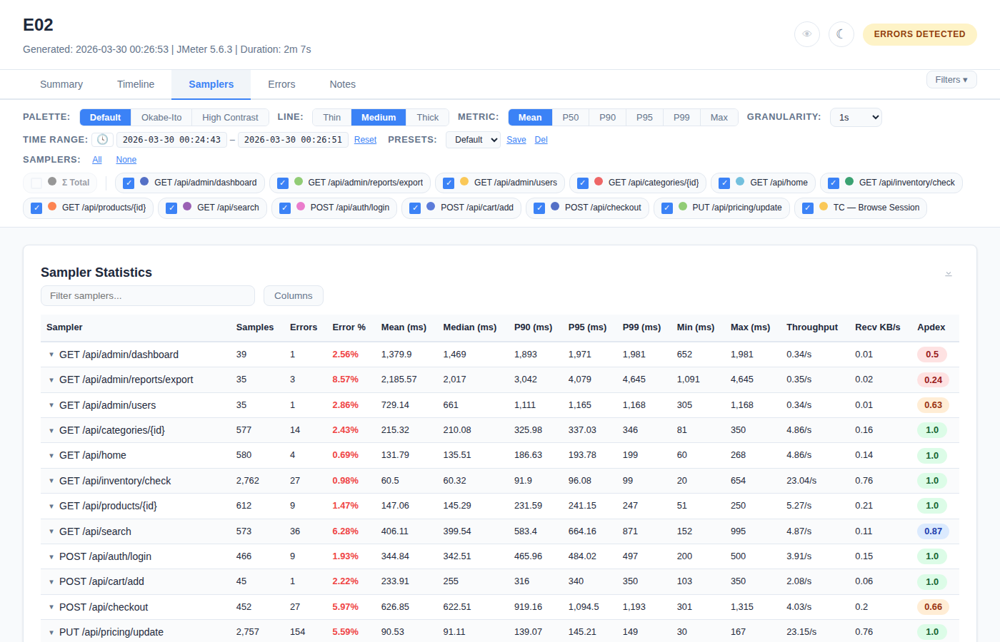
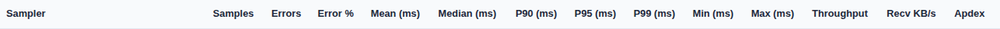
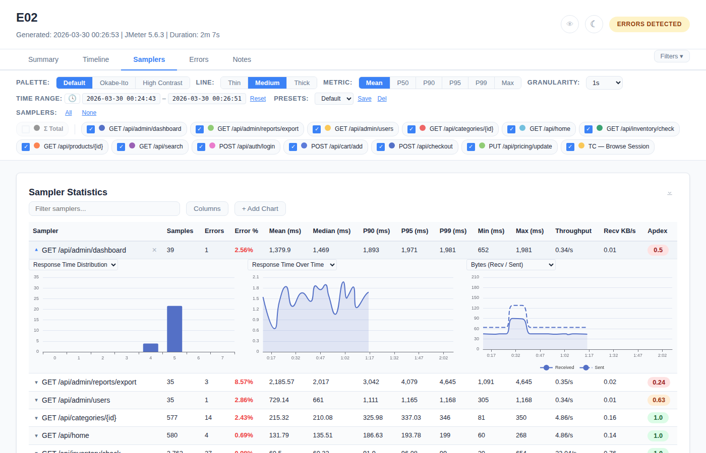

# Samplers Tab

Detailed per-sampler statistics table with sorting, filtering, column control, and inline chart expansion.

## Statistics Table

### Columns (14 total, all visible by default)

| Column | Description | Format |
|--------|-------------|--------|
| **Sampler** | Request label name | Text (truncated at 350px with ellipsis, hover for full name) |
| **Samples** | Total request count | Integer with comma separator |
| **Errors** | Failed request count | Integer |
| **Error %** | Error rate | Percentage (e.g., "4.05%") |
| **Mean (ms)** | Average response time | Decimal |
| **Median (ms)** | P50 response time | Decimal |
| **P90 (ms)** | 90th percentile | Decimal |
| **P95 (ms)** | 95th percentile | Decimal |
| **P99 (ms)** | 99th percentile | Decimal |
| **Min (ms)** | Minimum response time | Decimal |
| **Max (ms)** | Maximum response time | Decimal |
| **Throughput** | Requests per second | Decimal (e.g., "15.23") |
| **Recv KB/s** | Received bytes per second | Decimal |
| **Apdex** | Application Performance Index | 0.00–1.00 |

### Σ Total Row

A virtual aggregate row that always appears at the top of the table:
- **Default state:** Hidden (Σ Total checkbox is unchecked in the filter bar)
- **Enable:** Check the "Σ Total" checkbox in the sampler filter bar
- **Values:** Weighted averages for response times, summed counts, overall error rate
- **Chart behavior:** When enabled, appears as a dashed line in time-series charts

### SLA Badges

When SLA thresholds are configured (via `report-annotations.json`):
- Each sampler row shows a PASS/WARN/FAIL badge next to the sampler name
- Badge colors: green (PASS), amber (WARN), red (FAIL)

### Sampler Notes

When sampler notes are configured in annotations:
- A blue (i) icon appears next to the sampler name
- Hover to see the note text as a tooltip

## Table Interactions

### Sorting

- Click any **column header** to sort ascending
- Click the **same header again** to sort descending
- Visual indicator (▲/▼) appears on the sorted column

### Search / Filter

- A **text input** above the table filters rows by sampler name
- Matching is case-insensitive
- Non-matching rows are hidden (not removed)
- Clear the input to restore all rows

### Column Visibility

- Click the **"Columns"** button to open a dropdown
- All 14 columns listed with checkboxes (all checked by default)
- **Uncheck** a column → it disappears from the header and all data rows
- **Re-check** → column reappears in its original position
- Multiple columns can be hidden simultaneously

### Row Hiding

- Each data row has an **X (hide) button**
- Click X → row disappears from the table
- A **"Show N Hidden Rows"** button appears above the table
- Click it → all hidden rows restored

### CSV Export

- Click the **↓ icon** to download the table as `sampler-statistics.csv`
- Exports **all data** including hidden rows and columns

## Click-to-Expand Detail View

Click any sampler row to expand an inline detail panel:

### Expand/Collapse

- **Click row** → detail panel appears below the row
- **Chevron** changes from ▼ (grey) to ▲ (blue)
- **Click row again** → panel collapses, chevron reverts

### Chart Slots

The detail panel has **3 chart slots** by default:

| Slot | Default Chart | Description |
|------|---------------|-------------|
| 1 | Response Time Distribution | Histogram of response time bins |
| 2 | Response Time Over Time | Line chart for this sampler only |
| 3 | Bytes (Recv / Sent) | Received and sent bytes over time |

### Chart Slot Controls

- **Dropdown selector** on each slot — change the chart type:
  - Response Time Distribution (histogram)
  - Response Time Over Time
  - Bytes (Recv / Sent)
  - Throughput Over Time
  - Error Rate Over Time
  - Connect Time & Latency
  - Percentiles Over Time (P50/P90/P95/P99)
- **"+ Add Chart"** button — adds a 4th chart slot (max 4)
- **"× Remove Chart"** button — removes the last slot (min 1)
- Changes apply to **all currently expanded rows** (global sync)
- Configuration saved to localStorage

## Transaction Controller Hierarchy

When the test has Transaction Controllers (parent/child sampler hierarchy):

### Default Behavior

- Only **parent transactions** and **standalone samplers** are shown
- Child samplers are hidden from the table, filter bar, and charts
- This matches JMeter's native Aggregate Report behavior
- **No double-counting:** Parents aggregate their children

### Transaction Details Toggle

- A **"Transaction Details"** button appears in the Samplers tab toolbar
- **Default:** OFF (children hidden)
- **Toggle ON:**
  - Child samplers appear indented below their parents
  - Children show full statistics and mini-charts
  - Parent rows display a ▶ triangle icon
  - Children also appear in the filter bar with checkboxes
- **Toggle OFF:**
  - Children hidden again
  - Σ Total values unchanged (never double-counted)

### Detection

Transaction controller hierarchy is detected automatically from sampler name patterns:
- Parent: `"Login Flow"`
- Children: `"Login Flow-Authenticate"`, `"Login Flow-Get Profile"`
- Separator characters: `-`, ` `, `/`
