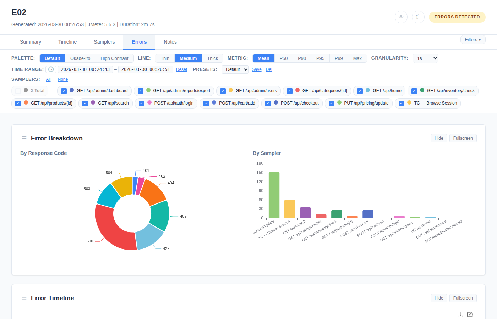
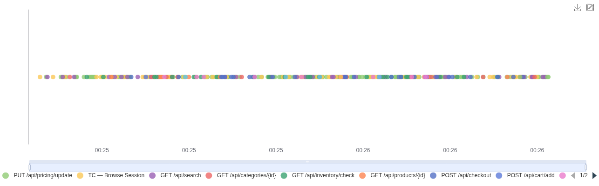
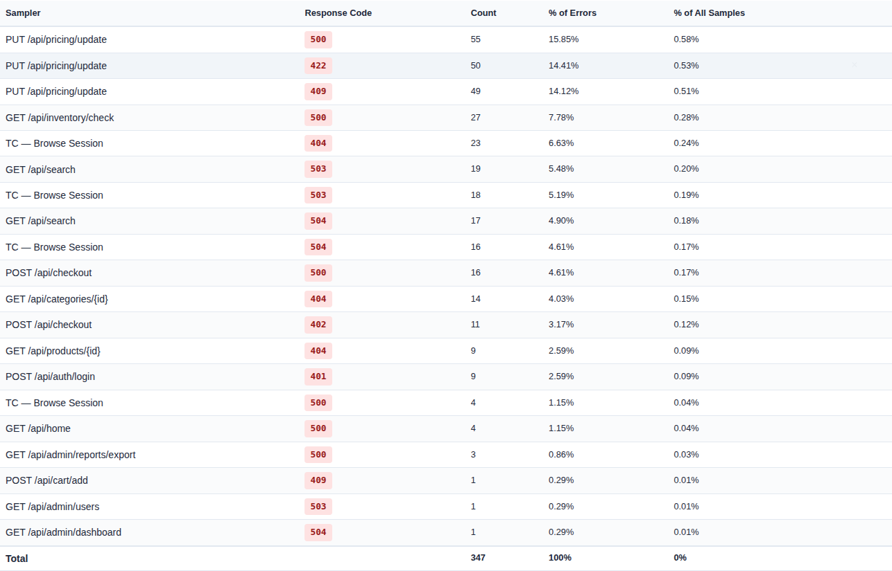
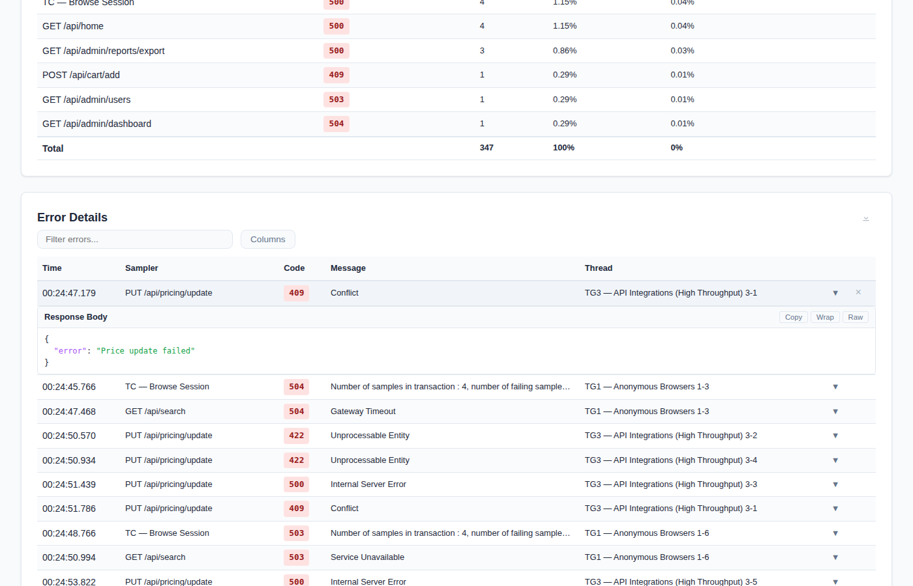
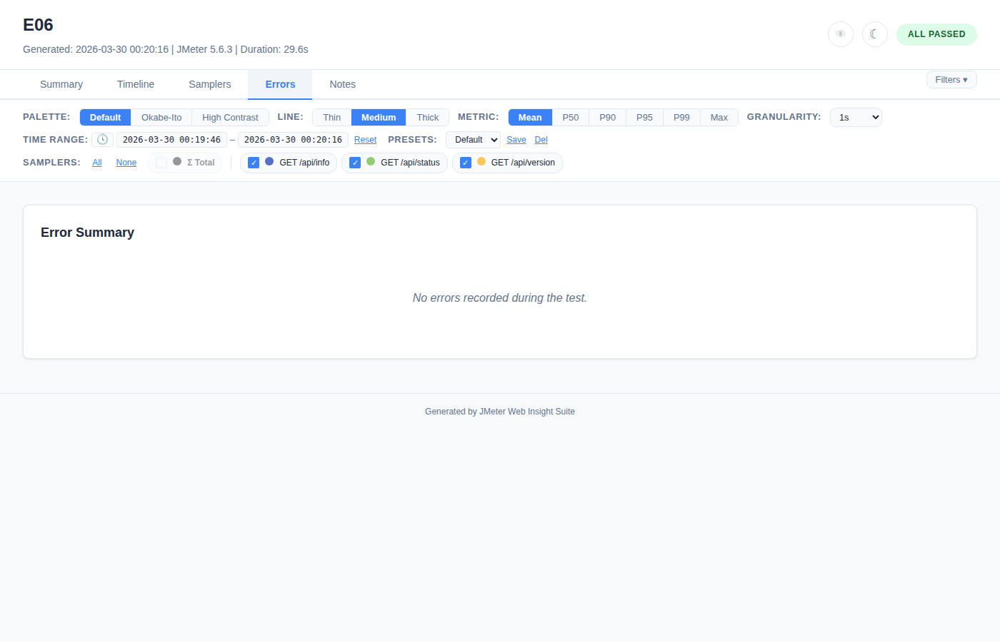
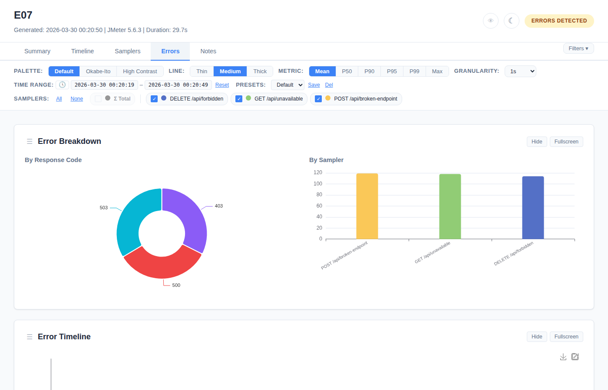

# Errors Tab

Error breakdown charts and detail tables for investigating test failures.



## Error Charts

Three charts provide different views of error data:

### Error Breakdown by Response Code (Pie Chart)



- Donut/pie chart showing error distribution by HTTP status code
- Fixed colors per code: 500=red, 401=blue, 404=amber, etc.
- Hover for exact counts and percentages

### Error Breakdown by Sampler (Bar Chart)

- Horizontal bar chart showing error count per sampler
- Uses the sampler palette colors (matches the filter bar color dots)
- Quickly identifies which requests fail most

### Error Timeline (Scatter Plot)

- Individual error occurrences plotted over time
- Each dot = one error, colored by sampler
- Reveals error bursts and patterns (e.g., errors clustered during a specific time window)

### Chart Controls

All error charts have:
- **Hide/Show** button — same behavior as Timeline tab
- **Fullscreen** button
- **"Show N Hidden Charts"** restore link when charts are hidden

## Error Summary Table



Groups errors by **sampler + response code** with aggregate counts.

| Column | Description |
|--------|-------------|
| **Sampler** | Request label |
| **Response Code** | HTTP status code (e.g., 500, 404) |
| **Count** | Number of occurrences |
| **% of Errors** | Percentage of total errors |
| **% of All Samples** | Percentage of all requests |

**Controls:**
- **Search** — filter rows by text
- **Column toggle** — show/hide columns
- **Row hide** — X button per row, "Show Hidden" to restore
- **CSV download** — exports as `error-summary.csv`

## Error Details Table

Individual error records with request-level detail.

| Column | Description |
|--------|-------------|
| **Time** | Timestamp of the error |
| **Sampler** | Request label |
| **Code** | HTTP response code |
| **Message** | Response message text |
| **Thread** | JMeter thread name |

### Expandable Error Rows



Click any error detail row to expand:
- **Request URL** — the URL that failed
- **Request Headers** — captured headers (truncated to 2KB)
- **Response Body** — the error response body with JSON auto-formatting and syntax highlighting

**Response body size limit:** Default 16KB. Configure via:
```bash
-Jwebinsight.error.body.maxsize=32768   # 32KB
```

Click again to collapse.

**Note:** URL and response body are only available in listener mode. JTL-parsed reports show response code, message, and thread but not body.

**Controls:** Same as Error Summary (search, column toggle, row hide, CSV download as `error-details.csv`)

## Sampler Filter Integration

All error views respect the sampler filter:
- **Uncheck a sampler** → its errors disappear from all 3 charts and both tables
- **Re-check** → errors reappear
- This allows focusing on specific request types when investigating failures

## Edge Cases

- **Zero errors:** Error tab shows no charts and empty tables (no crashes or layout issues)



- **100% errors:** All charts render normally, all table rows show error data


