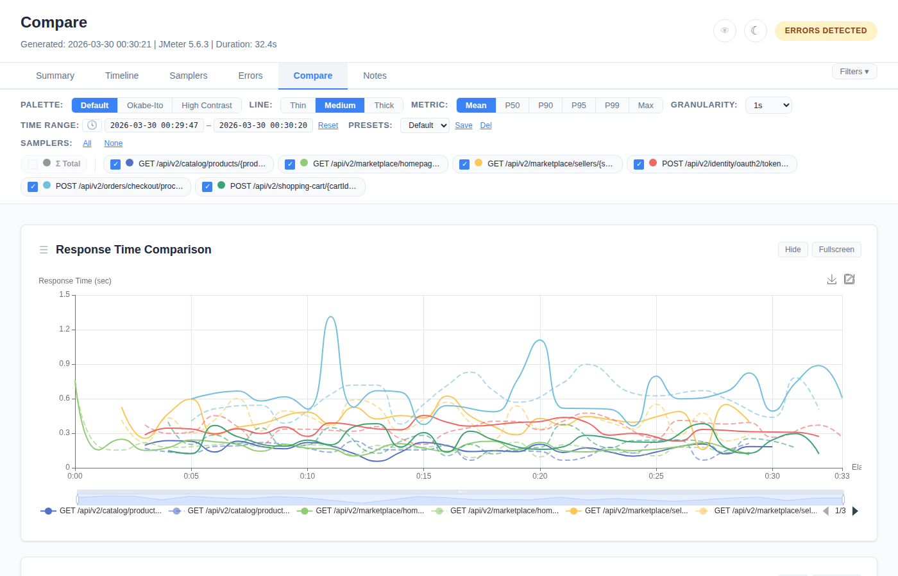
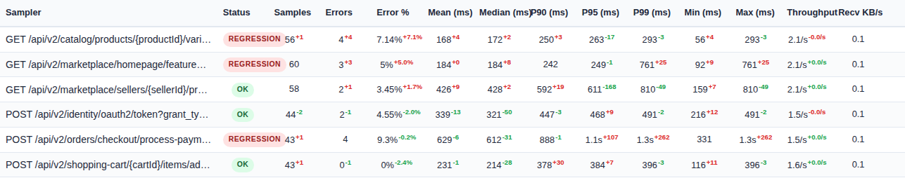

# Compare Tab

Baseline vs current run comparison with regression detection.

## Setup

**Auto-detection:** Place a previous run's JTL file as `baseline.jtl` in the report output directory. The plugin auto-detects it and enables the Compare tab.

```bash
# Example: copy previous results as baseline
cp previous-results.jtl /output/dir/baseline.jtl

# Run new test — Compare tab will appear in the report
jmeter -n -t test.jmx -Jwebinsight.report.output=/output/dir
```

**Explicit path via CLI:** Use `-Jwebinsight.report.baseline` to point to a specific file:

```bash
jmeter -n -t test.jmx \
  -Jwebinsight.report.baseline=/path/to/previous-results.jtl
```

This is useful when the baseline JTL is stored in a different location (e.g., a CI artifact from the previous build).

When a baseline is loaded, the **Compare** tab button becomes visible in the tab navigation (it is hidden by default when no baseline exists).



## Comparison Charts

### Response Time Comparison

- **Current run:** solid lines per sampler
- **Baseline run:** dashed lines per sampler
- Both aligned by elapsed time (starting from 0)
- Respects the **Metric toggle** (Mean/P50/P90/P95/P99)
- Respects the **Sampler filter** (deselected samplers hidden)

### Throughput Comparison

- Same current (solid) vs baseline (dashed) layout for throughput
- Per-sampler series

Both charts support: fullscreen, hide/show, zoom, cross-chart sync, dark mode, PNG/SVG export.

## Sampler Comparison Table



| Column | Description |
|--------|-------------|
| **Sampler** | Request label |
| **Status** | Badge: OK, REGRESSION, or NEW |
| **Samples** | Current count with delta (superscript) |
| **Errors** | Current count with delta |
| **Error %** | Current rate with delta |
| **Mean (ms)** | Current value with delta |
| **Median (ms)** | Current value with delta |
| **P90 (ms)** | Current value with delta |
| **P95 (ms)** | Current value with delta |
| **P99 (ms)** | Current value with delta |
| **Min (ms)** | Current value with delta |
| **Max (ms)** | Current value with delta |
| **Throughput** | Current value with delta |
| **Recv KB/s** | Current value with delta |

### Delta Values

Each metric shows a superscript delta:
- **Green** (or blue in colorblind mode) — improvement (lower response time, fewer errors)
- **Red** (or orange in colorblind mode) — regression (higher response time, more errors)
- Format: "+12.5%" or "-3.2%"

### Status Badges

| Badge | Color | Condition |
|-------|-------|-----------|
| **OK** | Green | No regression detected |
| **REGRESSION** | Red | P95 increased > threshold OR error rate increased > threshold |
| **NEW** | Blue | Sampler exists in current but not in baseline |

### Table Controls

Same as Samplers tab: sortable columns, drag-to-reorder, column toggle, row hide, search filter, CSV download (`comparison.csv`).

## Regression Thresholds

Thresholds that determine what constitutes a "regression":

| Metric | Default | Meaning |
|--------|---------|---------|
| **P95 % change** | 10% | P95 increase > 10% → REGRESSION |
| **Error rate change** | 2% | Error rate increase > 2pp → REGRESSION |
| **Mean % change** | Disabled (-1) | Not checked by default |
| **P99 % change** | Disabled (-1) | Not checked by default |
| **Throughput % change** | Disabled (-1) | Not checked by default |

### Configuration

**Via `report-annotations.json`:**
```json
{
  "comparisonThresholds": {
    "p95PctChange": 15,
    "errorRateChange": 3,
    "meanPctChange": 20,
    "p99PctChange": -1,
    "throughputPctChange": -1
  }
}
```

**Via JMeter CLI properties:**

| Property | Default |
|----------|---------|
| `webinsight.compare.p95.threshold` | `10` (%) |
| `webinsight.compare.errorrate.threshold` | `2` (%) |
| `webinsight.compare.mean.threshold` | `-1` (disabled) |
| `webinsight.compare.p99.threshold` | `-1` (disabled) |
| `webinsight.compare.throughput.threshold` | `-1` (disabled) |

```bash
-Jwebinsight.compare.p95.threshold=15
-Jwebinsight.compare.errorrate.threshold=3
-Jwebinsight.compare.mean.threshold=20
-Jwebinsight.compare.p99.threshold=25
-Jwebinsight.compare.throughput.threshold=10
```

Set any threshold to **-1** to disable that check. CLI properties override annotation values.

### Live Threshold Controls


The Compare tab includes UI controls to adjust thresholds on-the-fly:
- Input fields for each threshold metric
- **"Apply"** button to re-evaluate regression flags client-side
- Useful for exploring what thresholds make sense for your application
- Changes are local (do not modify the annotations file)

## "What Changed" Summary

Auto-generated text in the **Notes tab** when baseline comparison exists:
- Overall P95 and error rate trend direction
- List of regressed samplers with % change
- List of improved samplers with % change
- New samplers not in baseline

Updates live when regression thresholds are adjusted via the Compare tab controls.
