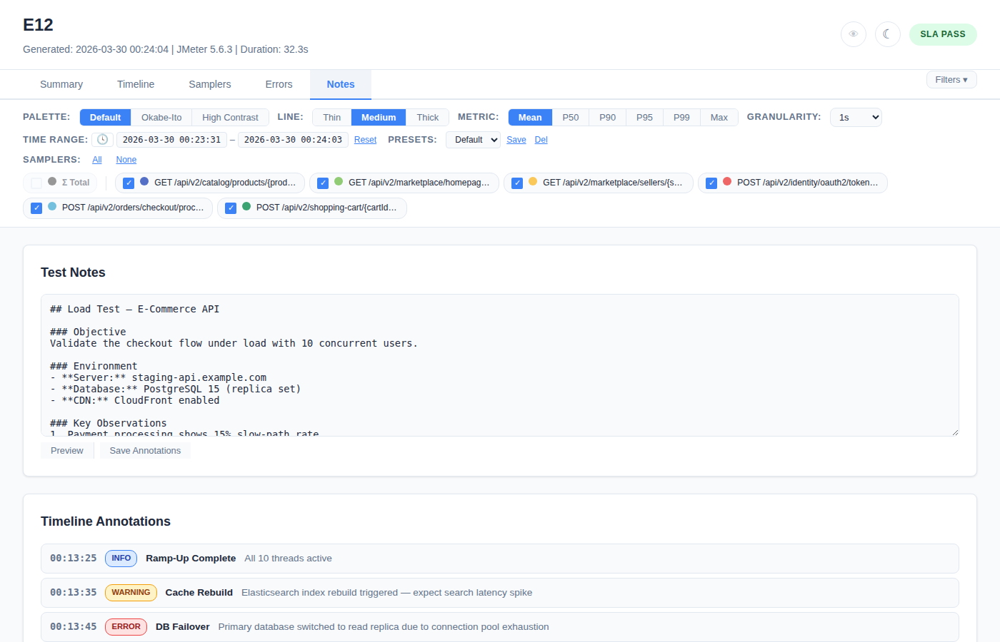
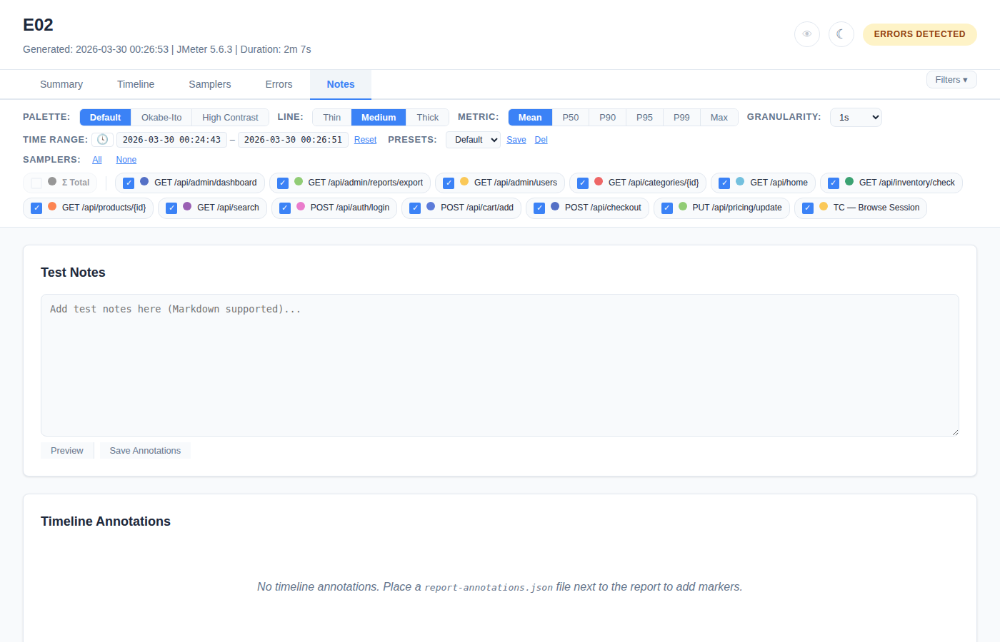

# Notes Tab

Test annotations, markdown notes, verdict, and timeline markers.

## With Annotations (report-annotations.json)

When a `report-annotations.json` file is present in the output directory, the Notes tab renders:

### Test Notes



Markdown-formatted text rendered as HTML:
- Headings (h1-h6)
- Bold, italic, code
- Bullet and numbered lists
- Code blocks
- Links

### Verdict Badge

A prominent badge showing the overall test verdict:

| Verdict | Color | Meaning |
|---------|-------|---------|
| **PASS** | Green | Test meets all criteria |
| **WARN** | Amber | Test has warnings |
| **FAIL** | Red | Test failed criteria |
| **CONDITIONAL_PASS** | Blue | Pass with conditions |

### Timeline Markers

Vertical dashed lines drawn on all time-series charts at annotated timestamps.

| Marker Type | Color |
|-------------|-------|
| `info` | Blue |
| `warning` | Amber |
| `error` | Red |
| `deployment` | Blue |
| `custom` | Purple |

Each marker has:
- **Label** — short text shown on the chart
- **Description** — detailed text shown on hover

### Sampler Notes

Per-sampler annotations shown as blue (i) icons in the Samplers tab table:
- Icon appears next to the sampler name
- Hover to see the note text as a tooltip

### "What Changed" Summary

When baseline comparison exists, an auto-generated summary of regressions and improvements appears in the Notes tab.

## Without Annotations

When no `report-annotations.json` is found, the Notes tab provides:



### Markdown Editor

- **Textarea** — type markdown text
- **Live preview** — renders markdown as you type (right panel)
- **"Save Annotations"** button — downloads a JSON file that can be used in future runs

This allows engineers to write notes directly in the report and export them for the next run.

## Annotations JSON Format

```json
{
  "version": "1.0",
  "testNotes": "## Test Objective\nValidate checkout under 500 users.",
  "verdict": "PASS",
  "slaThresholds": {
    "default": { "p95": 1000, "errorRate": 5.0 }
  },
  "samplerNotes": {
    "POST /api/checkout": "Includes 2s payment delay"
  },
  "timelineMarkers": [
    {
      "timestamp": 1773702727000,
      "label": "DB Failover",
      "type": "warning",
      "description": "Primary DB switched to replica"
    }
  ],
  "comparisonThresholds": {
    "p95PctChange": 15,
    "errorRateChange": 3
  }
}
```

**Auto-detection:** The plugin looks for `report-annotations.json` in:
1. The report output directory
2. JMeter's `bin/` directory

Or specify explicitly: `-Jwebinsight.report.annotations=/path/to/annotations.json`
