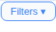
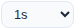
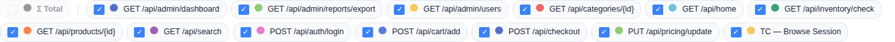

# Filter Bar

A persistent control bar below the tabs that affects all tabs globally.

## Collapsible Rows

The filter bar has 3 rows, each independently collapsible:

| Row | Contents | Default |
|-----|----------|---------|
| **Row 1** | Palette, Line thickness, Metric toggle, Granularity | Visible |
| **Row 2** | Time Range display, Timer/Clock toggle, Presets | Visible |
| **Row 3** | Sampler checkboxes, All/None buttons, color dots | Visible |

**Toggle visibility:** Click **"Filters ▾"** in the tab navigation → dropdown with 3 checkboxes. Uncheck a row to hide it. Hiding a row does NOT reset its settings — all filters remain active.

**Persistence:** Row visibility state saved to localStorage.

## Row 1: Palette / Line / Metric / Granularity

### Palette Selection

Three built-in color palettes for chart lines:

| Palette | Description | Default |
|---------|-------------|---------|
| **Default** | Standard ECharts palette (blue, green, gold, red, ...) | Yes |
| **Okabe-Ito** | Colorblind-friendly (deuteranopia/protanopia safe) | No |
| **High Contrast** | Maximum visual separation between series | No |

**Behavior:** Click a button → all chart lines update to the new palette colors. Sampler color dots in the filter bar also update. Persists in localStorage.

### Line Thickness

| Option | Width | Default |
|--------|-------|---------|
| **Thin** | 1px | No |
| **Medium** | 2px | Yes |
| **Thick** | 3px | No |

**Behavior:** Click a button → all chart line widths update. Persists in localStorage.

### Metric Toggle

| Option | Data Shown | Default |
|--------|------------|---------|
| **Mean** | Average response time | Yes |
| **P50** | 50th percentile (median) | No |
| **P90** | 90th percentile | No |
| **P95** | 95th percentile | No |
| **P99** | 99th percentile | No |
| **Max** | Maximum response time | No |

**Behavior:** Affects the Response Time Over Time chart on both Summary and Timeline tabs. Other charts (Throughput, Error Rate, etc.) are unaffected.

### Granularity

Dropdown controlling time-series aggregation level:

| Option | Bucket Size |
|--------|-------------|
| **1s** | Raw 1-second data |
| **5s** | 5-second averages |
| **10s** | 10-second averages |
| **30s** | 30-second averages |
| **1min** | 1-minute averages |
| **5min** | 5-minute averages |
| **10min** | 10-minute averages |

**Default:** Auto-detected based on test duration (1s for tests under 5 minutes).

**Behavior:** Changing granularity instantly re-renders all Timeline charts. Underlying data stays at 1-second resolution — only the display aggregation changes. Does NOT affect the Samplers table values.

## Row 2: Time Range / Presets

### Time Range Display

- **Start/End inputs** — read-only, show the current visible time range
- **Syncs with chart zoom** — when you zoom into a chart, these update
- **Reset button** — restores all charts to full time range

### Timer/Clock Toggle

- **Default:** Wall-clock time (e.g., "14:30:50")
- **Click toggle** → switches to elapsed time (e.g., "1:20:15")
- **Click again** → back to wall-clock
- Affects all chart X-axis labels

### Filter Presets

Save and restore complete filter configurations:

| Action | Behavior |
|--------|----------|
| **Save** | Saves: sampler visibility, metric, palette, line thickness, hidden columns |
| **Load** | Select from dropdown → all saved settings restored |
| **Delete** | Select preset → click Del → removed |
| **Default** | Always-present option that resets everything to factory defaults |

Presets are stored in localStorage under the key `wir_filterPresets`.

## Row 3: Samplers

### Sampler Checkboxes

- One checkbox per sampler, labeled with the sampler name
- **Default:** All regular samplers checked. Σ Total unchecked. Utility samplers (JSR223*, Debug*, BeanShell*) unchecked.
- **Uncheck** a sampler → its data disappears from:
  - All time-series charts (line removed)
  - Samplers table (row hidden)
  - Error tab (errors hidden)
  - Summary metrics update accordingly
- **Re-check** → everything restored

### All / None Buttons

- **All** — checks every checkbox
- **None** — unchecks every checkbox

### Σ Total Checkbox

- **Default:** Unchecked (Total not shown)
- **Check:** Adds a virtual aggregate row to the Samplers table and a dashed line to charts
- Values: weighted averages for response times, summed counts, overall error rate

### Per-Sampler Color Override

- Each sampler has a **color dot** next to its name
- **Click the dot** → color picker popup opens:
  - Grid of swatches from all palettes
  - Native `<input type="color">` for custom colors
- **Select a color** → dot updates, chart line color updates
- **Persistence:** Custom colors saved to localStorage

### Sampler Search

A text input to filter the sampler checkbox list by name. Type a partial name → only matching samplers visible.
