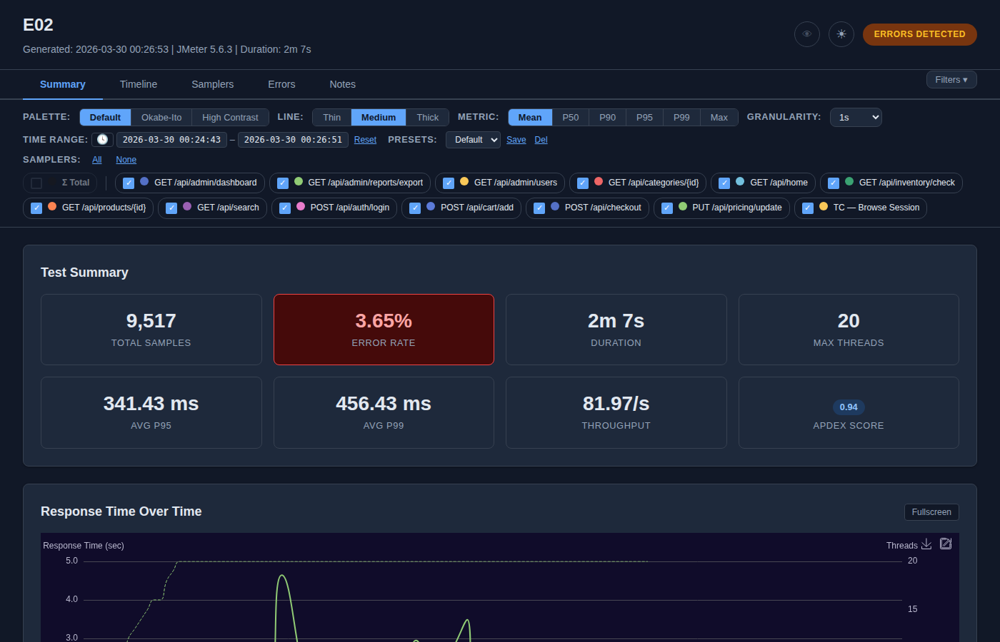
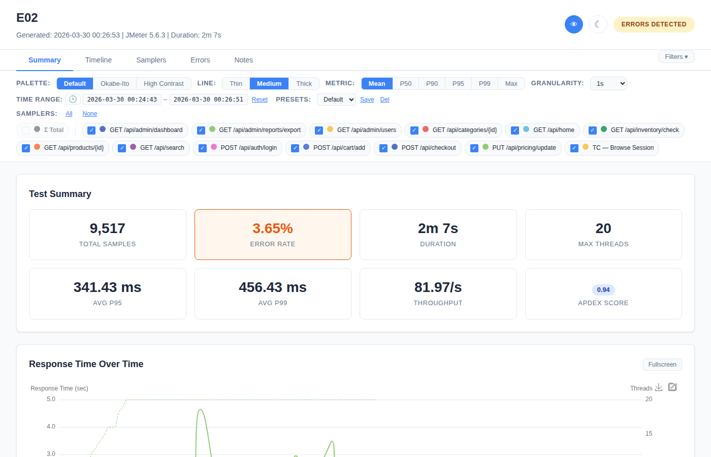

# Dark Mode & Accessibility

## Dark Mode

Toggle via the **moon/sun icon** (☾/☀) in the header.

### What Changes

| Element | Light → Dark |
|---------|-------------|
| **Background** | White → dark grey (#1a1a2e) |
| **Text** | Dark grey → light grey/white |
| **Cards** | White cards → dark cards |
| **Tables** | White rows → dark rows with subtle borders |
| **Charts** | Light theme → ECharts dark theme (dark canvas bg) |
| **Badges** | Standard colors → dark-appropriate tones |
| **Buttons** | Light bg → dark bg with light text |
| **Detail panels** | Light bg → dark bg |

### Behavior

- **Default:** OFF (light theme)
- **Toggle:** Click icon → body gets `dark-mode` CSS class
- **Icon changes:** ☾ (light mode) → ☀ (dark mode)
- **Charts reinitialize:** ECharts instances rebuild with dark theme
- **Persistence:** Saved to localStorage; survives page reload

## Colorblind Mode

Toggle via the **eye icon** (👁) in the header.

### What Changes

Swaps all semantic colors from green/red to blue/orange:

| Element | Standard | Colorblind |
|---------|----------|------------|
| **PASS badge** | Green | Blue |
| **FAIL badge** | Red | Orange |
| **OK delta** | Green superscript | Blue superscript |
| **Regression delta** | Red superscript | Orange superscript |
| **Error cards** | Red tones | Orange tones |
| **Improvement** | Green | Blue |

### Behavior

- **Default:** OFF
- **Toggle:** Click icon → body gets `cb-mode` CSS class
- **Icon opacity:** 0.4 (off) → 1.0 (on)
- **Title attribute:** Updates to "Colorblind mode (on)" / "(off)"
- **Persistence:** Saved to localStorage

### Combined Modes

Dark mode and colorblind mode work independently — all 4 combinations are supported:
1. Light + Standard (default)
2. Light + Colorblind
3. Dark + Standard
4. Dark + Colorblind

Both CSS classes (`dark-mode` + `cb-mode`) can be applied simultaneously.

## Color Palettes

Chart line colors are controlled separately from semantic colors:

| Palette | Best For |
|---------|----------|
| **Default** | General use |
| **Okabe-Ito** | Colorblind users (deuteranopia/protanopia safe) |
| **High Contrast** | Presentations, printed reports |

Palette selection is in the filter bar, not the header. See [Filter Bar](08-Filter-Bar.md) for details.

## Recommendations

| Audience | Suggested Settings |
|----------|-------------------|
| Screen viewing | Default palette, Medium lines |
| Colorblind users | Okabe-Ito palette + Colorblind mode ON |
| Presentations (projector) | High Contrast palette, Thick lines, Dark mode |
| Printing | Default palette, Thin lines, Light mode |
