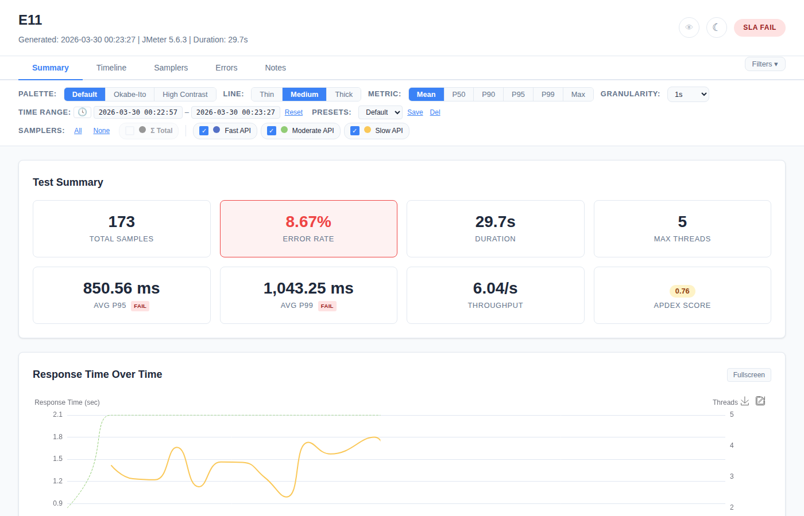
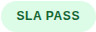
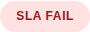
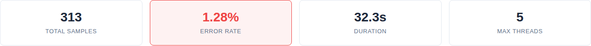
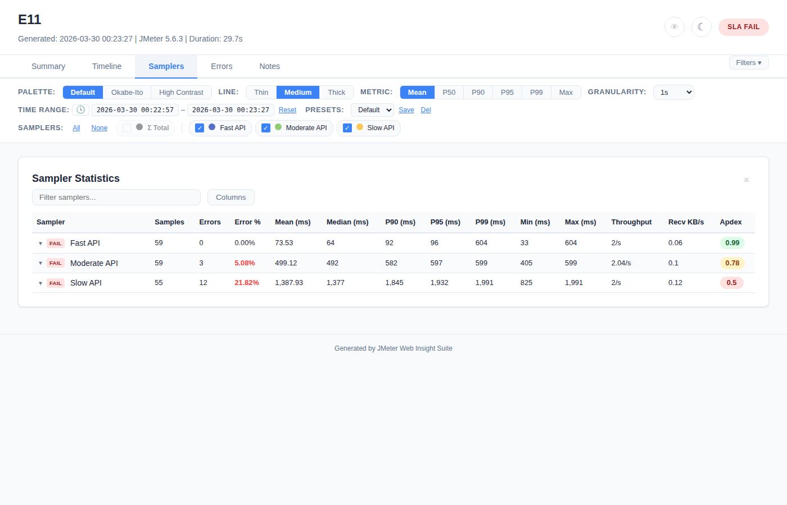
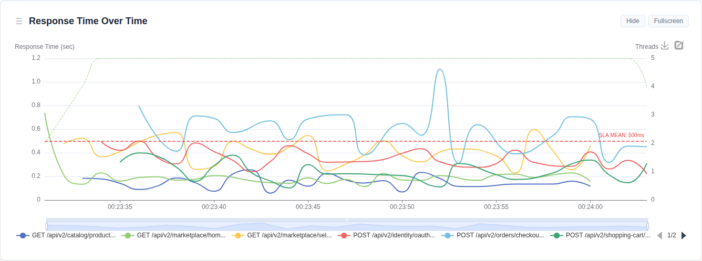

# SLA Evaluation & Apdex Score



## SLA Configuration

SLA thresholds are defined in a `report-annotations.json` file:

```json
{
  "slaThresholds": {
    "default": {
      "p95": 1000,
      "p99": 2000,
      "errorRate": 5.0,
      "meanResponseTime": 500
    },
    "POST /api/checkout": {
      "p95": 2000,
      "errorRate": 3.0
    }
  }
}
```

- **`default`** — fallback thresholds for all samplers
- **Per-sampler** — override `default` for specific samplers (by exact name match)
- **Supported metrics:** `p95`, `p99`, `errorRate`, `meanResponseTime`
- **Partial config allowed:** only configure the metrics you care about

### How to Load Annotations

**Auto-detection:** Place `report-annotations.json` in the report output directory — the plugin finds it automatically.

**Explicit path via CLI:** Use `-Jwebinsight.report.annotations` to point to a specific file:

```bash
jmeter -n -t test.jmx \
  -Jwebinsight.report.annotations=/path/to/my-sla-config.json
```

This is useful when:
- Multiple JMX files share the same output directory but need different SLA thresholds
- The same JMX runs with different test profiles (stress, spike, soak) each requiring different pass/fail criteria
- The annotations file is stored in a central location (e.g., a CI/CD config repo)

### Example: Same JMX, Different SLA Per Scenario

```bash
# Stress test — lenient SLA (sustained load, some degradation acceptable)
jmeter -n -t load-test.jmx \
  -Jthreads=100 -Jduration=600 \
  -Jwebinsight.report.annotations=sla/stress-sla.json \
  -Jwebinsight.report.filename=stress-report.html

# Spike test — strict SLA (fast recovery expected)
jmeter -n -t load-test.jmx \
  -Jthreads=500 -Jduration=60 \
  -Jwebinsight.report.annotations=sla/spike-sla.json \
  -Jwebinsight.report.filename=spike-report.html
```

Where `stress-sla.json`:
```json
{ "slaThresholds": { "default": { "p95": 2000, "errorRate": 10.0 } } }
```

And `spike-sla.json`:
```json
{ "slaThresholds": { "default": { "p95": 500, "errorRate": 1.0 } } }
```

Each run produces its own report with its own pass/fail evaluation — same test plan, different acceptance criteria.

## SLA Evaluation Logic

| Status | Condition |
|--------|-----------|
| **PASS** | Metric value < 80% of threshold |
| **WARN** | Metric value between 80% and 100% of threshold |
| **FAIL** | Metric value > threshold |

The **worst status** across all configured metrics determines the sampler's overall SLA result. The **worst across all samplers** determines the overall report status.

## SLA Display Locations

### Header Badge

The overall SLA status as a prominent badge:
- `SLA PASS` — green badge



- `SLA WARNING` — amber badge
- `SLA FAIL` — red badge



### Summary Cards



SLA mini-badges appear on the Avg P95 and Avg P99 cards showing whether the overall average meets the threshold.

### Samplers Table

Each sampler row shows a PASS/WARN/FAIL badge next to the sampler name. The badge reflects the worst metric for that sampler.



### Chart Threshold Lines

When SLA is configured, horizontal red dashed lines appear on Response Time charts at the threshold value for the currently selected metric:

- **Mean metric selected** → line at `meanResponseTime` threshold (e.g., 500ms)
- **P95 metric selected** → line at `p95` threshold (e.g., 1000ms)
- **P99 metric selected** → line at `p99` threshold (e.g., 2000ms)

The line label shows "SLA MEAN: 500ms" (or corresponding metric name and value).



**Behavior:**
- Uses the `default` SLA threshold values
- Line updates automatically when switching the Metric toggle
- Styled as red (#ef4444) dashed line with 1.5px width
- Only appears when the current metric has a configured threshold

## Apdex Score

The Application Performance Index (Apdex) is computed per sampler and overall.

### Formula

```
Apdex = (Satisfied + Tolerating / 2) / Total
```

Where:
- **Satisfied:** response time < T
- **Tolerating:** response time ≥ T and < 4T
- **Frustrated:** response time ≥ 4T

### Configuration

**Default threshold T:** 500ms

**Override:**
- CLI: `-Jwebinsight.apdex.threshold=300`
- Annotations JSON: set `apdexThreshold` within `slaThresholds`

### Score Interpretation

| Score | Rating | Color |
|-------|--------|-------|
| > 0.94 | Excellent | Green |
| 0.85 – 0.94 | Good | Blue |
| 0.70 – 0.85 | Fair | Amber |
| 0.50 – 0.70 | Poor | Orange |
| ≤ 0.50 | Unacceptable | Red |

### Display

- **Summary tab:** Apdex card with overall weighted score and color badge
- **Samplers table:** Apdex column showing per-sampler scores (0.00–1.00)
- **CI/CD JSON:** `apdex` field in each sampler object

### Sorting by Apdex

In the Samplers table:
- Click **Apdex** column header to sort ascending (worst first)
- Click again for descending (best first)
- Useful for quickly identifying the worst-performing samplers

## CI/CD JSON Output

The machine-readable JSON includes SLA status and Apdex:

```json
{
  "testName": "Load Test",
  "status": "FAIL",
  "samplers": [
    {
      "name": "POST /checkout",
      "sampleCount": 1234,
      "mean": 891,
      "p95": 2340,
      "errorRate": 0.8,
      "apdex": 0.72,
      "slaStatus": "FAIL"
    }
  ],
  "slaViolations": [
    { "sampler": "POST /checkout", "status": "FAIL" }
  ]
}
```

## JUnit XML Output

When enabled (`-Jwebinsight.report.junit=true`), each sampler becomes a JUnit test case:
- **PASS samplers** → passed test cases
- **FAIL samplers** → test cases with `<failure>` element containing metric details
- Compatible with Jenkins, GitHub Actions, Azure DevOps, GitLab CI
